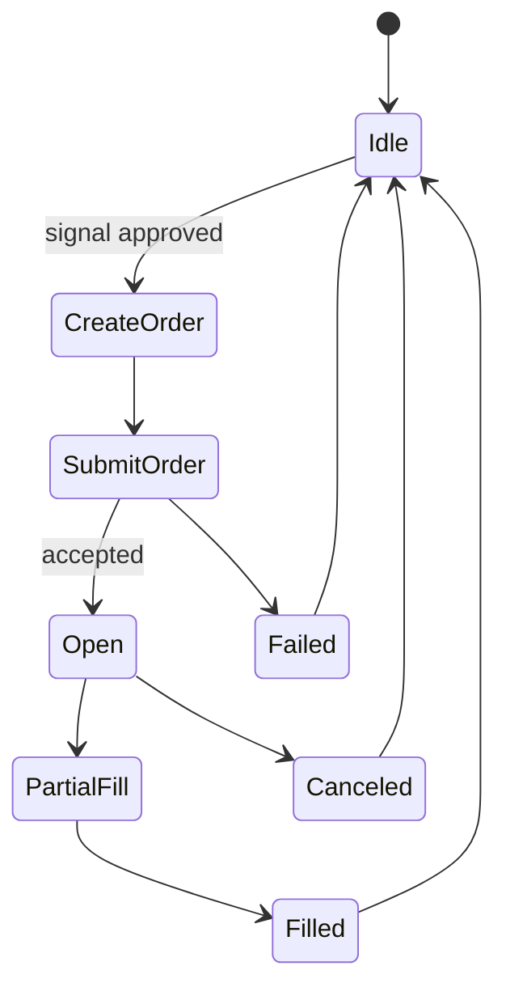
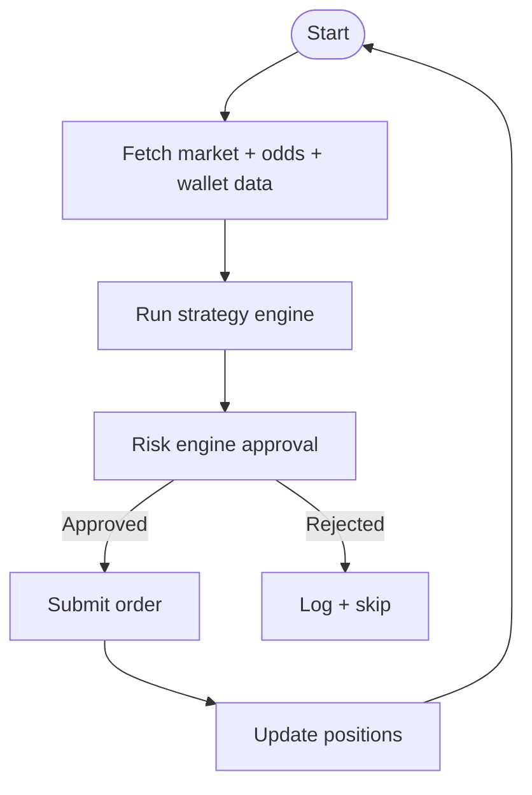
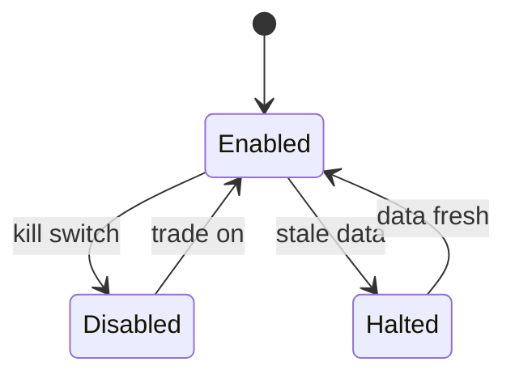
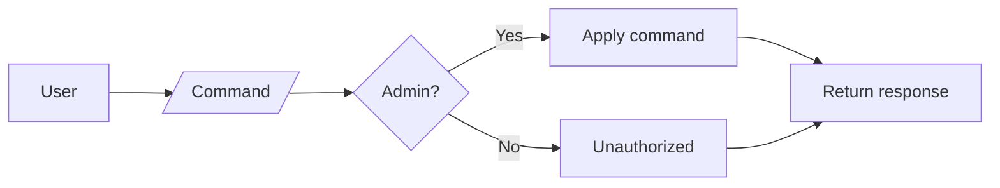

# Polysport Diagrams

## Order Lifecycle

```mermaid
stateDiagram-v2
  [*] --> Idle
  Idle --> CreateOrder: signal approved
  CreateOrder --> SubmitOrder
  SubmitOrder --> Open: accepted
  Open --> PartialFill
  PartialFill --> Filled
  Open --> Canceled
  SubmitOrder --> Failed
  Failed --> Idle
  Filled --> Idle
  Canceled --> Idle
```

## Strategy Evaluation Loop

```mermaid
flowchart TD
  Start([Start]) --> FetchData[Fetch market + odds + wallet data]
  FetchData --> GenerateSignals[Run strategy engine]
  GenerateSignals --> RiskCheck[Risk engine approval]
  RiskCheck -->|Approved| Execute[Submit order]
  RiskCheck -->|Rejected| Halt[Log + skip]
  Execute --> UpdateState[Update positions]
  UpdateState --> Start
```

## Risk Engine States

```mermaid
stateDiagram-v2
  [*] --> Enabled
  Enabled --> Disabled: kill switch
  Disabled --> Enabled: trade on
  Enabled --> Halted: stale data
  Halted --> Enabled: data fresh
```

## Telegram Command Flow

```mermaid
flowchart LR
  User --> Bot[/Command/]
  Bot --> Auth{Admin?}
  Auth -->|Yes| Execute[Apply command]
  Auth -->|No| Reject[Unauthorized]
  Execute --> Response[Return response]
  Reject --> Response
```
